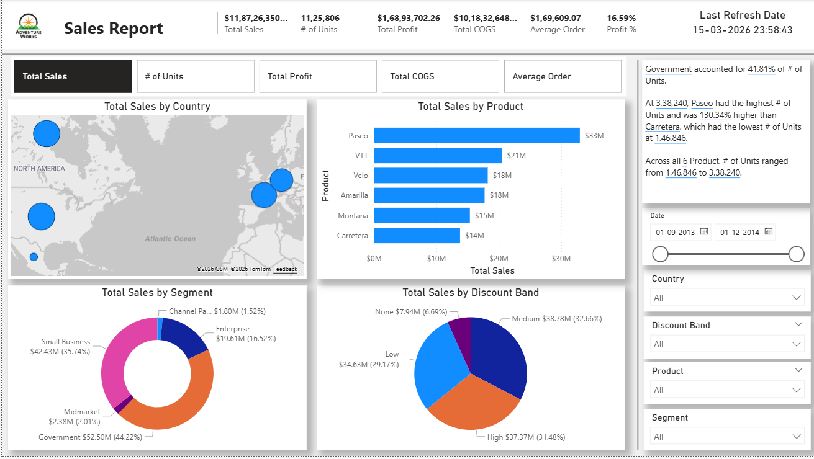
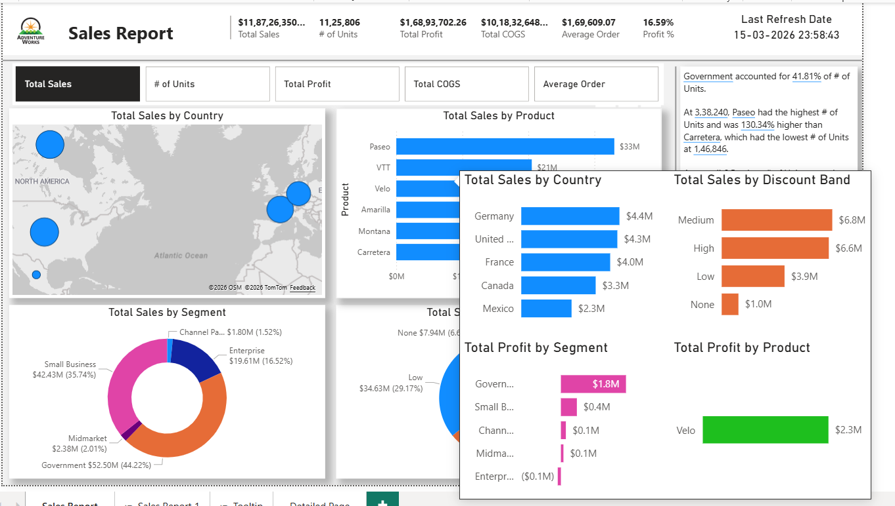
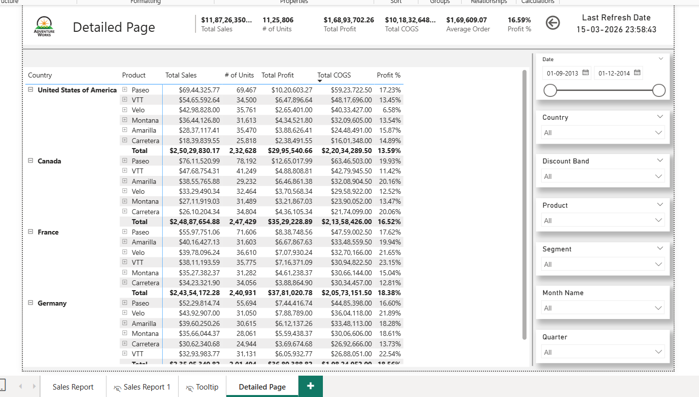

# Sales Performance Analytics Dashboard

A Power BI analytics solution designed to uncover revenue drivers, product performance trends, and regional sales insights through interactive visual storytelling.

This dashboard helps decision-makers quickly understand **where revenue is generated, which products drive profitability, and how discount strategies impact margins.**

---

# Business Objective

Organizations often struggle to identify:

• Which products generate the most revenue  
• Which customer segments drive profitability  
• How discount strategies affect margins  
• Which regions contribute most to sales performance  

This dashboard centralizes these insights into a **single interactive analytics experience**.

---

# Key Business Metrics

• **Total Sales:** $118.7M  
• **Total Units Sold:** 1.12M  
• **Total Profit:** $16.8M  
• **Total COGS:** $101.8M  
• **Average Order Value:** $169K  
• **Profit Margin:** 16.59%

---

# Key Insights

**1️⃣ Product Performance**

Paseo is the top performing product generating **$33M+ revenue**, significantly outperforming other products.

**2️⃣ Customer Segments**

Government and Small Business segments contribute the **largest portion of revenue**.

**3️⃣ Discount Strategy Impact**

Medium and High discount bands account for **over 60% of total sales**, indicating strong dependency on promotional pricing.

**4️⃣ Regional Distribution**

North America drives the **highest sales concentration**, highlighting strong regional market penetration.

---

# Dashboard Features

### Dynamic KPI Selection
Users can switch between key performance metrics using **Field Parameters**, enabling flexible performance analysis.

### Advanced Tooltips
Hovering over visuals reveals additional contextual insights through **custom tooltip pages**.

### Interactive Drill-Through Analysis
Users can drill from **country level → product level performance** using a dedicated detailed analysis page.

### Multi-Dimensional Analysis
The dashboard supports slicing data across:

• Product  
• Customer Segment  
• Discount Band  
• Geography  
• Time

---

# Tools & Technologies

• Power BI  
• DAX  
• Data Modeling  
• Field Parameters  
• Advanced Tooltips  
• Drill-through Navigation

---

# Dashboard Preview

## Main Dashboard

## Advanced Tooltip View

## Detailed Drill-through Analysis

